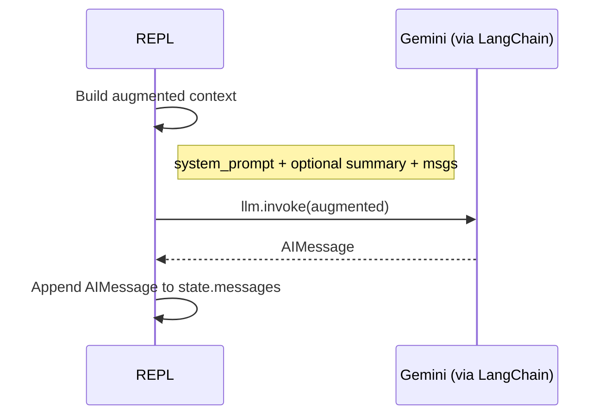
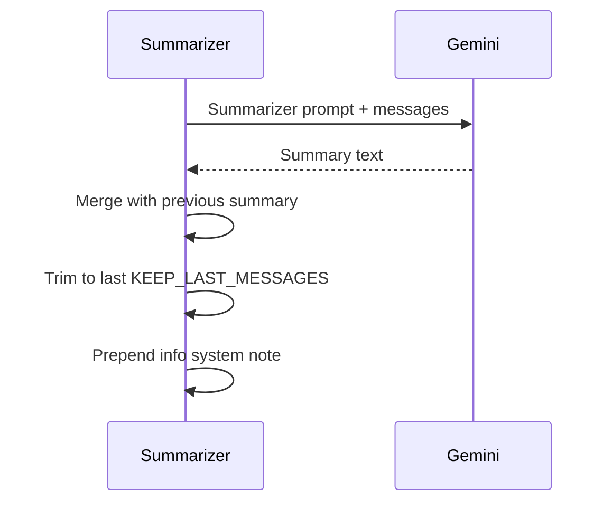

# LangGraph Conversational Agent (AI/ML Study Assistant)

This repository contains a **graph-driven conversational agent** built with **LangGraph** and **LangChain**, integrated with **Google Gemini** via `langchain-google-genai`. The assistant is tailored for **Computer Science & AI/ML learners**, providing:

- Clear, step-by-step explanations.
- Runnable code examples when requested.
- Conversation memory via summarization to keep context tight and relevant.
- Automatic transcript logging (TXT + JSONL).

> **Author:** Ayush Mishra  
> **Use case:** Study assistant for CS (AI/ML), REPL-based interface.

---

## Table of Contents

1. [Key Capabilities](#key-capabilities)
2. [System Architecture](#system-architecture)
3. [Conversation Flow Diagram](#conversation-flow-diagram)
4. [How It Works (Step-by-Step)](#how-it-works-step-by-step)
5. [Setup & Installation](#setup--installation)
6. [Environment & Configuration](#environment--configuration)
7. [Running the Agent](#running-the-agent)
8. [Usage Tips](#usage-tips)
9. [Project Structure](#project-structure)
10. [Design Choices & Rationale](#design-choices--rationale)
11. [Extending the Agent](#extending-the-agent)
12. [Troubleshooting](#troubleshooting)
13. [Security & Privacy Notes](#security--privacy-notes)
14. [Contributing](#contributing)
15. [License](#license)

---

## Key Capabilities

- **Conversational Memory**: When the dialogue grows beyond a threshold, the agent **summarizes** the past messages into a compact memory string and **trims** older history while keeping the last few messages.
- **Graph-based Orchestration**: Uses LangGraph's `StateGraph` with nodes for `process` (LLM call) and `summarize`, and a conditional router `should_summarize`.
- **LLM Integration**: `ChatGoogleGenerativeAI(model="gemini-2.5-flash")` for fast responses; you can tune temperature/top_p and safety.
- **Robust Prompting**: System messages ensure step-by-step, concise, example-driven outputs.
- **Logging**: Saves human/AI/system messages to `logging.txt` and a structured `logging.jsonl` with timestamps for analysis or replay.

---

## System Architecture

**Core components:**

- **AgentState (TypedDict)** — Carries `messages` and an optional `summary`.
- **LLM (Gemini via LangChain)** — The brain of the assistant.
- **Nodes:**
  - `process(state)` — Builds context (system prompt + optional summary + history), invokes the LLM, appends the AI response.
  - `summarize(state)` — Creates/updates a concise bullet-style memory, trims message history, adds a system info note.
- **Router:**
  - `should_summarize(state)` — Counts human+AI messages and decides whether to jump to `summarize` or end.
- **REPL (`main`)** — Reads user input, feeds the graph, prints responses, and persists logs on exit.

**Constants controlling memory:**

- `MAX_MESSAGES_BEFORE_SUMMARY = 12`
- `KEEP_LAST_MESSAGES = 6`

---

## Conversation Flow Diagram

The following **Mermaid** diagram illustrates the flow from user input through processing and conditional summarization:

```mermaid
flowchart TD
    A[Start / REPL] --> B[Append HumanMessage]
    B --> C[process(state)]
    C --> D{should_summarize?}
    D -- yes --> E[summarize(state)]
    E --> F[Trim history & update summary]
    F --> G[Return new state]
    D -- no --> G[Return new state]
    G --> H{User continues?}
    H -- yes --> B
    H -- exit --> I[save_transcript(messages, summary)]
    I --> J[End]
```

**Inside `process(state)`**:



**Inside `summarize(state)`**:



---

## How It Works (Step-by-Step)

1. **Initialization**: A system prompt is added to `AgentState.messages`, setting tone and goals.
2. **User Input**: In the REPL, you type a query; it becomes a `HumanMessage` appended to the state.
3. **Processing**: `process(state)` constructs `augmented` input (system prompt + optional summary + full message list) and calls the LLM.
4. **Response**: The LLM returns an `AIMessage`; the state is **immutably** updated by appending it.
5. **Routing**: `should_summarize(state)` checks the count of human/AI messages; if the threshold is reached, control goes to `summarize(state)`.
6. **Summarization**: The conversation is summarized into bullets; older messages are trimmed while keeping `KEEP_LAST_MESSAGES`, and a system note indicates compression.
7. **Loop**: Back to the REPL; you continue or type `exit` to save transcripts.

---

## Setup & Installation

```bash
# 1) Clone
git clone https://github.com/your-username/langgraph-conversational-agent.git
cd langgraph-conversational-agent

# 2) Python environment (recommended)
python -m venv .venv
source .venv/bin/activate  # Windows: .venv\\Scripts\\activate

# 3) Install dependencies
pip install -r requirements.txt
```

> If you don't have a `requirements.txt` yet, see the section below or create one:

```text
langchain
langgraph
langchain-google-genai
python-dotenv
```

---

## Environment & Configuration

Create a `.env` file in the project root:

```env
GOOGLE_API_KEY=your_api_key_here
```

- The code uses `dotenv.load_dotenv()` to pick up this key.
- You can also configure model parameters (e.g., temperature/top_p) in the `ChatGoogleGenerativeAI` instantiation.

---

## Running the Agent

```bash
python main.py
```

**Interactive Controls**:

- Type your message and press **Enter** to converse.
- Type `exit` (or press `Ctrl+C`) to stop; transcripts are saved to `logging.txt` and `logging.jsonl`.

---

## Usage Tips

- Ask for **step-by-step explanations** (e.g., "Explain gradient descent with a small example").
- Request **runnable code** (e.g., "Give me a Python snippet to implement k-NN").
- For long sessions, the agent will **summarize** and keep recent messages, maintaining coherence without overloading the context.

---

## Project Structure

```
├─ main.py                 # REPL entrypoint; builds initial state and runs the graph
├─ README.md               # This documentation
├─ logging.txt             # Human-readable transcript
├─ logging.jsonl           # Structured logs for analysis/replay
└─ (your Python module)    # Where the functions/classes live
```

**Key functions in your code:**

- `process(state)` — LLM call with augmented context, immutable state update.
- `summarize(state)` — Summary creation/merge, history trimming, system note injection.
- `should_summarize(state)` — Router determining next node.
- `save_transcript(messages, summary)` — TXT + JSONL outputs.
- `main()` — REPL loop, graceful shutdown & save.

---

## Design Choices & Rationale

- **LangGraph for control flow**: Explicit nodes and edges make the **conversation pipeline** easy to reason about and extend (e.g., add a `tools` node, a `classification` node, or a `retrieval` node).
- **Summarization**: Long contexts can be expensive and noisy. Summarizing preserves **key intent and facts** while keeping token usage low.
- **Immutable state updates**: Aligns with functional patterns; easier debugging and predictable transitions.
- **Transcript logging**: Auditable conversations, helpful for evaluation, dataset building, and future fine-tuning.

---

## Extending the Agent

- **Add Tools**: Incorporate retrieval (RAG), calculators, or code executors by adding new nodes and edges in the graph.
- **Safety/Filtering**: Insert a moderation node before `process` or adjust system prompts to constrain outputs.
- **UI**: Replace REPL with a web UI (FastAPI/Flask + frontend) or a CLI wrapper.
- **Persistence**: Store summaries and conversations in a database for cross-session memory.

---

## Troubleshooting

- **API Errors**: Ensure `GOOGLE_API_KEY` is set and valid.
- **Model Access**: Confirm your account has access to the specified Gemini model.
- **Dependency mismatches**: Use a clean virtual environment and run `pip freeze` to inspect versions.
- **No logs created**: Check file permissions or run the script from the project root.

---

## Security & Privacy Notes

- Transcripts are saved locally (TXT + JSONL). Avoid sharing sensitive information.
- Rotate API keys and keep `.env` out of version control by adding it to `.gitignore`.
- Consider redaction or encryption for production deployments.

---

## Contributing

1. Fork the repository.
2. Create a feature branch: `git checkout -b feat/my-improvement`.
3. Make changes with tests/examples where relevant.
4. Open a Pull Request with a clear description and screenshots/recordings if UI-related.

---

## License

Licensed under the **MIT License**. See `LICENSE` for details.

---

## How I Built This (Author Notes)

1. **Picked the stack**: LangChain + LangGraph + Gemini (fast model for conversational tasks).
2. **Defined the state**: A minimal `AgentState` with `messages` and `summary` to keep implementation simple.
3. **Wrote the nodes**: `process` for the main LLM call; `summarize` to control context growth; a router `should_summarize`.
4. **REPL & logging**: Added a loop to read input, invoke the graph, and save transcripts on exit for reproducibility.
5. **Prompts**: Crafted system prompts that encourage step-by-step clarity and runnable code.
6. **Constants & tuning**: Set thresholds (`MAX_MESSAGES_BEFORE_SUMMARY`, `KEEP_LAST_MESSAGES`) after experimenting with usability and cost.
7. **Testing**: Ran local tests, checked failure paths (e.g., API exceptions) and added helpful fallback messages.

**Tip:** You can swap `gemini-2.5-flash` for a heavier model if you need more reasoning depth, or add domain tools to improve reliability on technical tasks.
