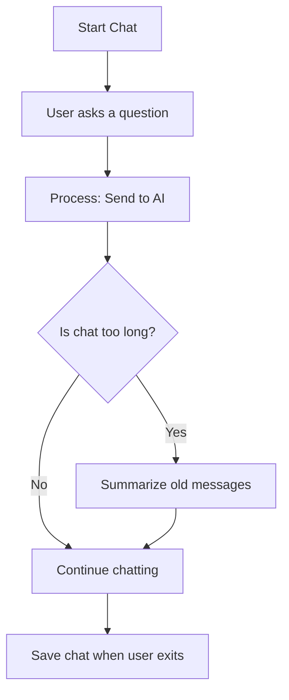

# LangGraph Conversational Chatbot

This project is a **simple AI chatbot** built using **LangGraph** and **LangChain**, powered by **Google Gemini**. It is designed to help students learn **Computer Science and AI/ML** concepts in an easy and interactive way.

---

## What is this chatbot?
This chatbot is like your personal study assistant. You can ask questions about programming, AI, or machine learning, and it will explain everything step by step. If you ask for code, it will give you **runnable Python examples**.

---

## Why did I make this?
I wanted to create a tool that:
- Helps students understand complex topics easily.
- Keeps the conversation short and clear by summarizing old messages.
- Saves your chat history so you can review it later.

---

## Features
- **Easy to use**: Just type your question and get an answer.
- **Step-by-step explanations**: Perfect for beginners.
- **Runnable code snippets**: Learn by doing.
- **Memory system**: Summarizes old messages when the chat gets too long.
- **Conversation logs**: Saves your chat in text and JSON format.

---

## How does it work?
1. You type a question.
2. The chatbot sends your question to Google Gemini (an AI model).
3. It gives you a clear answer with examples.
4. If the chat becomes too long, it summarizes old messages so the conversation stays short.
5. When you exit, it saves your chat history.

---

## Flow Diagram
Here is a simple diagram of how the chatbot works:



---

## How I built it
- Used **LangGraph** to create a flow for the chatbot.
- Added two main steps:
  - `process`: Sends your question to the AI and gets an answer.
  - `summarize`: Makes a short summary when the chat is too long.
- Added a **REPL loop** so you can chat in the terminal.
- Added **logging** to save your chat in `logging.txt` and `logging.jsonl`.

---

## Setup Instructions
1. Clone the repository:
   ```bash
   git clone https://github.com/your-username/langgraph-chatbot.git
   cd langgraph-chatbot
   ```

2. Install dependencies:
   ```bash
   pip install -r requirements.txt
   ```

3. Add your Google API key in a `.env` file:
   ```env
   GOOGLE_API_KEY=your_api_key_here
   ```

4. Run the chatbot:
   ```bash
   python main.py
   ```

---

## Requirements
- Python 3.8+
- langchain
- langgraph
- langchain-google-genai
- python-dotenv

---

## Usage
- Type your question and press Enter.
- Type `exit` to quit and save your chat.

---

## Author Notes
I made this project to learn how to build AI tools using LangGraph and LangChain. It is simple but powerful. You can improve it by adding:
- A web interface.
- More tools like calculators or code runners.
- Better memory system.

---

Enjoy learning with this chatbot! 😊
